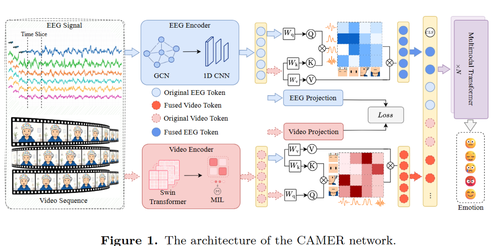
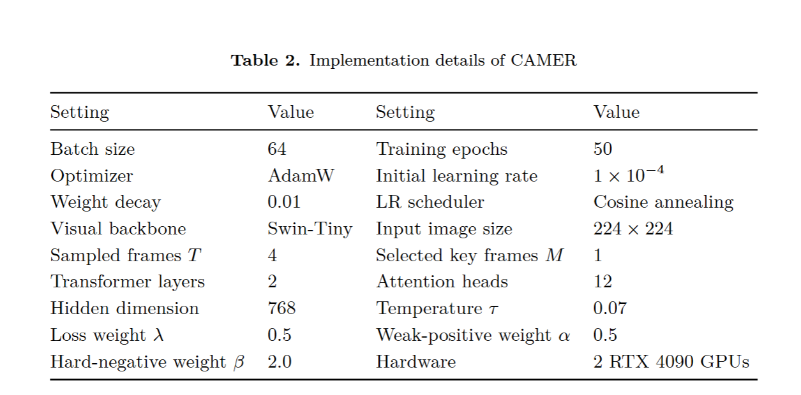

# CAMER

CAMER is an EEG-video emotion recognition model based on structured cross-modal contrastive alignment and interaction-guided multimodal fusion.



## Abstract

Multimodal emotion recognition aims to infer affective states by exploiting complementary information from facial videos and EEG recordings. CAMER uses a dual-stream encoder to extract modality-specific EEG and visual features, aligns the two modalities through structured supervised contrastive learning, and performs interaction-guided fusion with bidirectional cross-attention and a multimodal Transformer.

## Requirements

- Python 3.8+
- PyTorch
- Transformers

The visual encoder uses Swin-Tiny by default:

```text
microsoft/swin-tiny-patch4-window7-224
```

Pretrained weights can be loaded from HuggingFace or from the local `weights/` directory.

## Files

- `model.py`: CAMER model, EEG encoder, video encoder, cross-attention module, and structured supervised contrastive loss.
- `parameters.py`: dataset settings, channel orders, model hyperparameters, loss hyperparameters, and optimization settings.
- `assets/`: figures used in this README.

## Model Usage

```python
import torch.nn.functional as F

from model import build_camer_model, build_scl_loss
from parameters import TRAINING_PARAMS

model = build_camer_model(dataset_name="deap")
scl_criterion = build_scl_loss()
lambda_scl = TRAINING_PARAMS["lambda_scl"]

logits, z_e, z_v = model(eeg_data, images_data)

ce_loss = F.cross_entropy(logits, labels)
scl_loss = scl_criterion(z_e, z_v, labels, subject_ids)
loss = (1 - lambda_scl) * ce_loss + lambda_scl * scl_loss
```

Expected input shapes:

- EEG features: `(B, C, 5)`, where `C` is the number of EEG channels and `5` denotes five-band DE features.
- Video frames: `(B, T, H, W, 3)`.

## Parameters

The main implementation details are summarized below.



Default parameter values are defined in `parameters.py`.

- `batch_size`: 64.
- `epochs`: 50.
- `optimizer`: AdamW.
- `lr`: `1e-4`.
- `weight_decay`: `0.01`.
- `scheduler`: cosine annealing.
- `input_size`: 768.
- `num_encoder_layers`: 2.
- `num_heads`: 12.
- `num_select`: 1 selected key frame in the MIL module.
- `temperature`: 0.07 for supervised contrastive learning.
- `alpha`: 0.5 for weak-positive weighting.
- `beta`: 2.0 for hard-negative weighting.
- `lambda_scl`: 0.5 in `L = (1 - lambda_scl) * LCE + lambda_scl * LSCL`.

## Supported Datasets

| Dataset key | EEG channels | Classes |
| --- | ---: | ---: |
| `deap` | 32 | 4 |
| `mahnob-hci` | 32 | 4 |
| `mahnob` | 32 | 4 |
| `amigos` | 14 | 4 |
| `eav` | 30 | 5 |

The default evaluation protocol is five-fold cross-trial evaluation. For DEAP, MAHNOB-HCI, and AMIGOS, valence and arousal labels are binarized and combined into four classes. For EAV, the original five emotion categories are used.

## Reference

```text
Structured Cross-Modal Contrastive Alignment with Interaction-Guided Fusion
for EEG-Video Emotion Recognition
```
